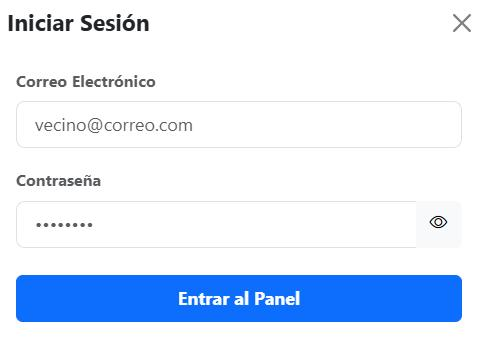
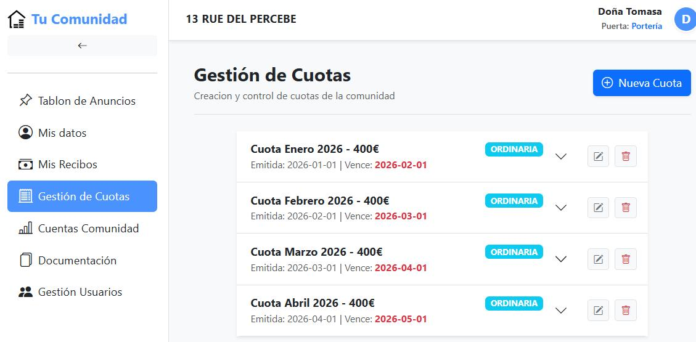
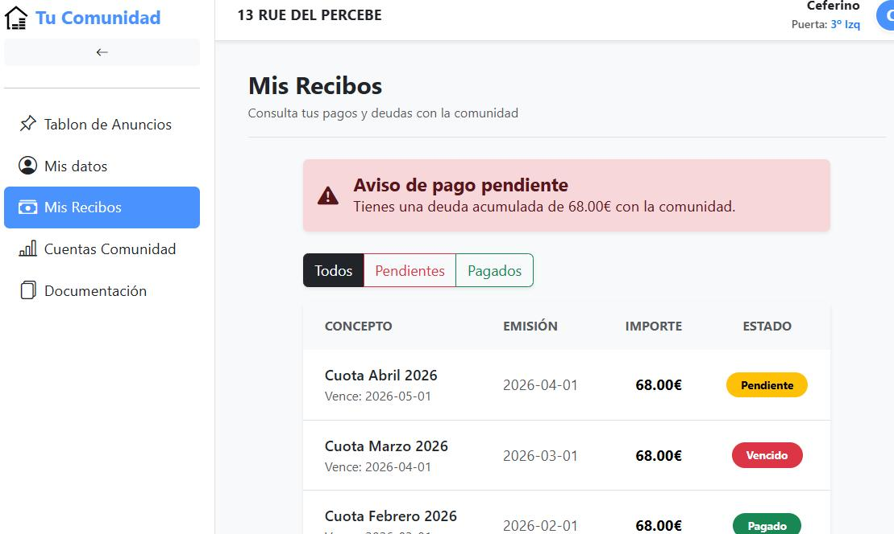
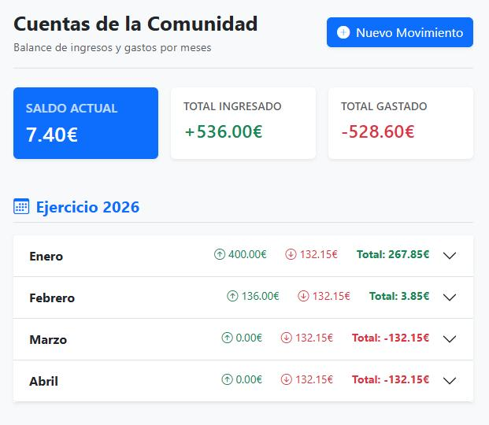
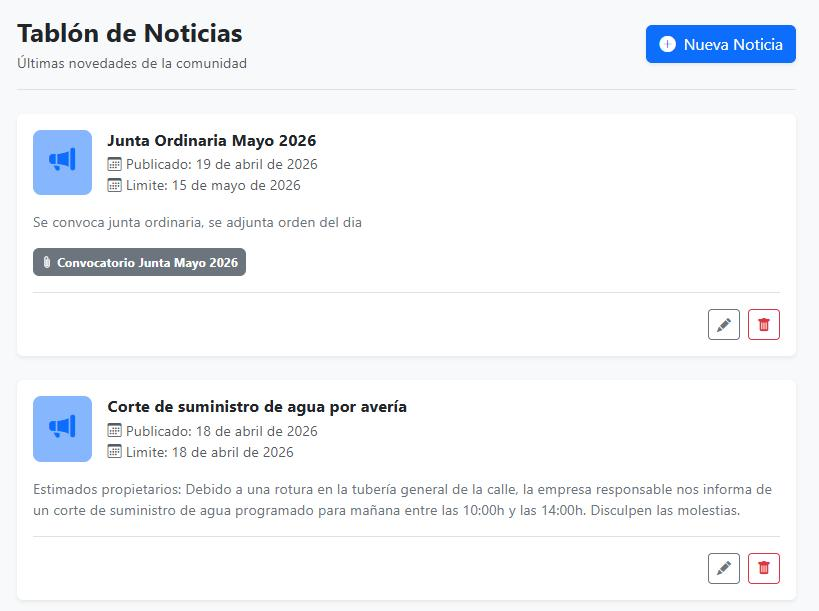
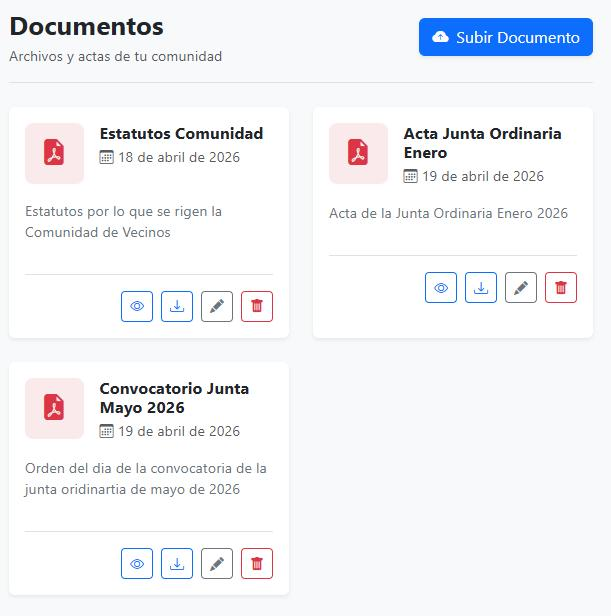
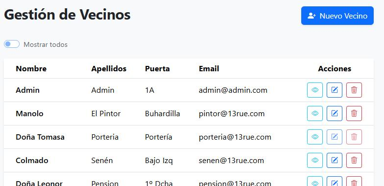
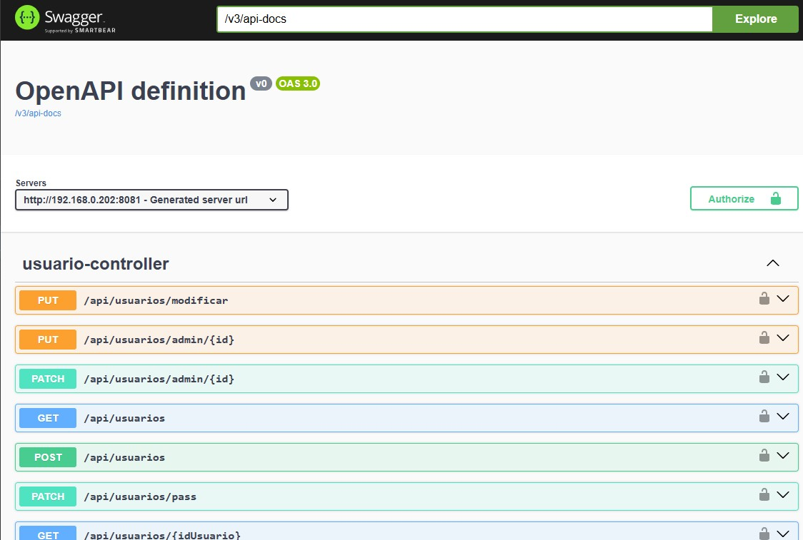
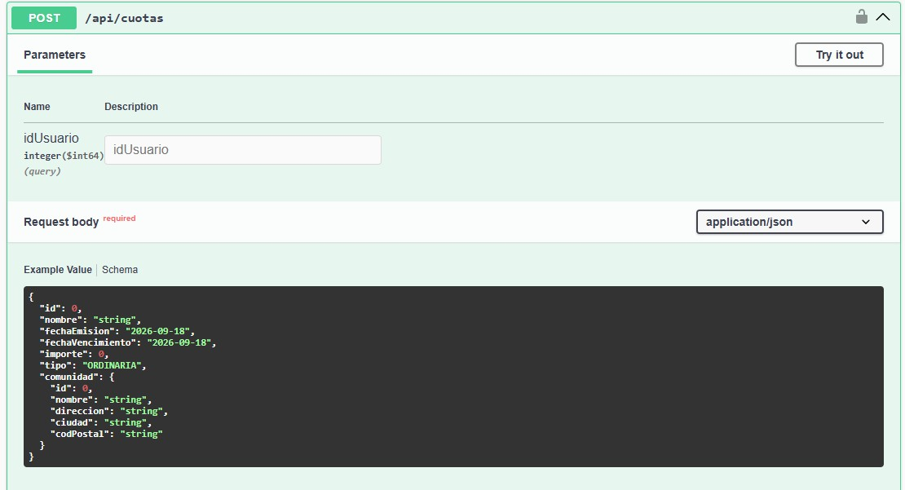
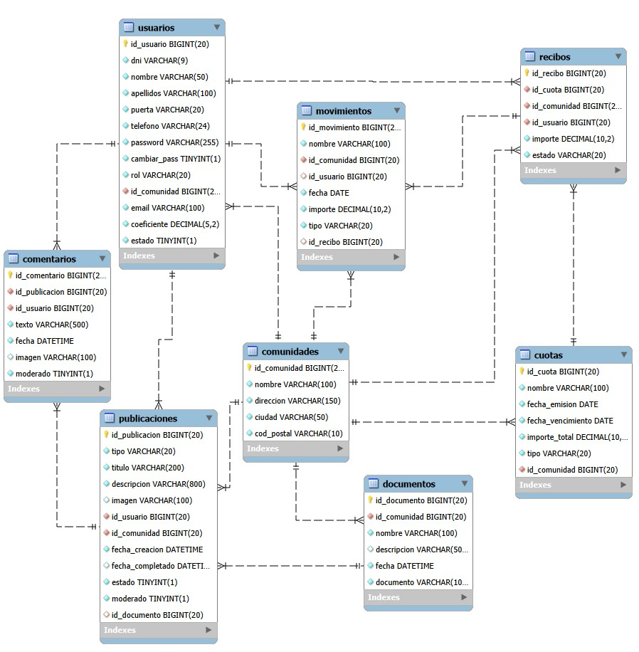

# Plataforma de Gestión de Comunidades de Vecinos

### Aplicación web full stack para la gestión y autogestión de comunidades de propietarios.

El proyecto permite gestionar usuarios, comunidades, cuotas, recibos, movimientos económicos, documentación y comunicaciones internas, con diferentes niveles de acceso según el rol del usuario.

> El backend está desarrollado con **Java 21** y **Spring Boot** y expone una **API REST** consumida por un frontend desarrollado con **React**.

Proyecto Intermodular (TFG) del ciclo de Desarrollo de Aplicaciones Web (DAW).

**Índice:** [Capturas](#capturas-de-la-aplicación) · [Descripción](#descripción) · [Funcionalidades](#funcionalidades-principales) · [Stack tecnológico](#stack-tecnológico) · [Arquitectura](#arquitectura) · [Estructura del proyecto](#estructura-del-proyecto) · [Lógica de negocio](#lógica-de-negocio) · [API REST](#api-rest) · [Seguridad](#seguridad-y-autenticación) · [Base de datos](#base-de-datos) · [Archivos y correo](#gestión-de-archivos-y-correo) · [Configuración y despliegue](#configuración-y-despliegue) · [Estado del proyecto](#estado-del-proyecto)

---

## Capturas de la aplicación

<div align="center">


<p><em>Pantalla de autenticación y acceso a la plataforma</em></p>

<br />


<p><em>Configuración y gestión de cuotas ordinarias y extraordinarias</em></p>

<br />


<p><em>Control del estado de recibos y cálculo por coeficientes</em></p>

<br />


<p><em>Registro de movimientos económicos, ingresos, gastos y saldo</em></p>

<br />


<p><em>Tablón de anuncios y comunicados oficiales para vecinos</em></p>

<br />


<p><em>Repositorio de documentación PDF y actas de la comunidad</em></p>

<br />


<p><em>Panel de administración y asignación de roles a propietarios</em></p>

</div>
---

## Descripción

La aplicación está orientada a la **autogestión de comunidades de propietarios**, centralizando en una única plataforma la información de usuarios, gestión económica, documentación y comunicaciones internas.

El sistema permite que el presidente de la comunidad, o la persona encargada de su gestión, utilice el perfil de **Administrador** para gestionar los diferentes aspectos de la comunidad, mientras que los propietarios pueden consultar la información que les corresponde según sus permisos.

A nivel técnico, el proyecto se estructura como una aplicación cliente-servidor, donde el **backend concentra la lógica de negocio, la persistencia de datos y el control de acceso**, mientras que el frontend proporciona la interfaz desde la que los usuarios interactúan con la aplicación.

### Roles

| Rol | Quién es |
|---|---|
| `USER` | Vecino de la comunidad. |
| `ADMIN` | Presidente, tesorero u otra persona encargada de gestionar la comunidad. |
| `SUPER_ADMIN` | Gestor de la plataforma. |


---

## Funcionalidades principales

### Gestión de comunidades

* Gestión de la información de las comunidades.
* Consulta de usuarios asociados a cada comunidad.

### Gestión de usuarios

* Alta, modificación y baja lógica de usuarios.
* Gestión de roles y asociación de usuarios a una comunidad.
* Contraseña inicial generada por el sistema, con cambio obligatorio en el primer acceso.
* Cambio de contraseña por parte del usuario.
* Restablecimiento de contraseña por parte del administrador, con envío de la nueva contraseña temporal por correo electrónico.

### Cuotas y recibos

* Creación y gestión de cuotas ordinarias, extraordinarias e individuales.
* Generación de recibos asociados a las cuotas.
* Cálculo de importes según el coeficiente de participación del propietario.
* Consulta y gestión del estado de los recibos.
* Control de recibos pendientes y vencidos.

### Gestión económica

* Registro y gestión de ingresos y gastos.
* Asociación de movimientos con una comunidad.
* Asociación de ingresos con recibos cuando corresponde.
* Consulta de movimientos y situación económica de la comunidad.
* Cálculo de ingresos, gastos y saldo.

### Comunicaciones y publicaciones

* Publicación de noticias y comunicados oficiales para los propietarios.
* Gestión de publicaciones por parte de los administradores.
* Asociación de documentación a publicaciones.

### Gestión documental

* Subida y gestión de documentos PDF.
* Asociación de documentos a una comunidad.
* Consulta y descarga de documentación.
* Modificación y eliminación de documentos.

---

## Stack tecnológico

| Capa | Tecnología |
|---|---|
| Frontend | React 19, Vite, React Router, Axios, Bootstrap 5 |
| Backend | Java 21, Spring Boot, Spring Security (JWT + BCrypt), Spring Data JPA, Spring Mail |
| Base de datos | MariaDB |
| Documentación de la API | OpenAPI 3.0 / Swagger UI (springdoc) |
| Servidor web | Nginx (frontend, proxy inverso de la API y ficheros estáticos) |

---

## Arquitectura


La aplicación sigue un modelo **cliente-servidor**: un frontend React que consume una API REST desarrollada con Spring Boot, respaldada por una base de datos relacional. Nginx se sitúa delante de ambos.

El backend se organiza en **capas**, cada una con una responsabilidad:

* **Controller**: recibe las peticiones HTTP, aplica las restricciones por rol y devuelve la respuesta.
* **Service**: contiene la lógica de negocio y las transacciones.
* **Repository**: acceso a datos con Spring Data JPA.
* **Entity**: modelo de dominio mapeado a la base de datos.
* **Security**: autenticación con JWT, filtro de peticiones y configuración de acceso.

El frontend separa las vistas (páginas), los componentes reutilizables y los servicios que se comunican con la API. El menú y las rutas se adaptan al rol del usuario autenticado.

---

## Estructura del proyecto

```text
Proyecto_comunidades/
│
├── backend/
│   └── src/main/java/
│       └── com.comunidad.comunidad_backend/
│           ├── controller/
│           ├── dto/
│           ├── entity/
│           ├── enums/
│           ├── repository/
│           ├── security/
│           └── service/
│
└── frontend/
    └── src/
        ├── components/
        ├── pages/
        └── services/
```

---

## Lógica de negocio

El backend concentra las principales reglas de negocio de la aplicación, realizando validaciones y operaciones antes de persistir los datos.

### Gestión de cuotas y generación de recibos

Las cuotas pueden ser **ordinarias**, **extraordinarias** o **individuales**:

* Las cuotas individuales se asocian a un propietario concreto, que asume el 100 % del importe.
* Las cuotas ordinarias y extraordinarias generan automáticamente un recibo para cada propietario de la comunidad que tenga definido un coeficiente de participación válido.
* El importe de cada recibo se calcula automáticamente a partir del importe de la cuota y el coeficiente de participación del propietario.
* Los importes de los recibos se calculan con `BigDecimal`, utilizando dos decimales y redondeo `HALF_UP`.
* El sistema permite consultar los recibos pendientes y los recibos vencidos de una comunidad.

### Control de modificaciones y eliminación

El sistema mantiene la relación entre las cuotas, los recibos y los movimientos económicos para evitar modificaciones que puedan afectar al histórico de la comunidad.

* Una cuota no puede modificarse si alguno de sus recibos ya tiene movimientos asociados.
* Una cuota no puede eliminarse mientras existan movimientos asociados a sus recibos.
* Cuando se modifica el importe de una cuota que todavía puede modificarse, los recibos existentes se eliminan y se generan nuevamente con los importes actualizados.

### Gestión de pagos

Los movimientos económicos distinguen entre **ingresos y gastos**.

* Solo un movimiento de tipo **INGRESO** puede estar asociado a un recibo.
* Cuando se registra un ingreso asociado a un recibo, este pasa automáticamente a estado **PAGADO**.
* Un recibo que ya está pagado no puede volver a marcarse como pagado.

### Control de acceso y pertenencia a comunidades

La aplicación es multiinquilino: cada comunidad solo debe ver y gestionar sus propios datos, y para ello cada registro lleva el identificador de su comunidad.

* Las operaciones de gestión utilizan el identificador de comunidad extraído del token JWT.
* En las cuotas y en la consulta de movimientos por identificador se comprueba que el recurso pertenece a la comunidad del usuario autenticado.
* Las operaciones disponibles dependen del rol del usuario autenticado.
* El sistema diferencia entre **SuperAdmin, Administrador y Usuario**, aplicando diferentes niveles de acceso según el rol.

---

## API REST

El backend expone una API REST para la comunicación con el frontend, organizada mediante diferentes recursos y operaciones HTTP.

Entre los principales recursos disponibles se encuentran:

```text
/api/login
/api/usuarios
/api/comunidades
/api/cuotas
/api/recibos
/api/movimientos
/api/documentos
/api/publicaciones
```

La API proporciona operaciones para la gestión de usuarios, comunidades, cuotas, recibos, movimientos económicos, documentación y publicaciones.

Los recursos utilizan diferentes métodos HTTP según la operación realizada, incluyendo `GET`, `POST`, `PUT`, `PATCH` y `DELETE`.

El acceso a los endpoints está protegido mediante **Bearer Token**, aplicando las restricciones correspondientes según el usuario autenticado y su rol.

La API está documentada mediante **OpenAPI 3.0**, utilizando **Swagger UI** para consultar los endpoints, parámetros, modelos de datos y esquemas disponibles.





---

## Seguridad y autenticación

La aplicación utiliza **Spring Security** para gestionar la autenticación y autorización de los usuarios mediante **JSON Web Tokens (JWT)**.

### Autenticación mediante JWT

El inicio de sesión se realiza mediante `POST /api/login`. El backend comprueba el correo electrónico, la contraseña y que el usuario se encuentre activo antes de generar el token.

Las contraseñas se almacenan utilizando **BCrypt**, evitando guardar las credenciales en texto plano.

El token JWT generado contiene información necesaria para identificar al usuario y aplicar las restricciones de acceso:

* Identificador del usuario.
* Identificador de la comunidad.
* Rol del usuario.
* Fecha de emisión y expiración.

Los tokens tienen una duración de **24 horas** y se utilizan mediante el esquema `Bearer Token`.

### Validación del token

Las peticiones autenticadas pasan  por un filtro basado en `OncePerRequestFilter`, que:

1. Obtiene el token del encabezado `Authorization`.
2. Extrae el usuario identificado en el token.
3. Recupera sus datos mediante `UserDetailsService`.
4. Comprueba la validez y expiración del token.
5. Establece la autenticación en el contexto de Spring Security.

La aplicación utiliza sesiones **stateless**, por lo que la autenticación de cada petición se basa en el token JWT.

### Autorización basada en roles

El acceso a los recursos se controla mediante **Spring Security** y restricciones a nivel de método (`@PreAuthorize`).

Se definen tres roles principales:

* `SUPER_ADMIN`
* `ADMIN`
* `USER`

Las operaciones disponibles dependen del rol del usuario. Las autoridades se cargan de la base de datos en cada petición, no del token, de modo que un cambio de rol se aplica de inmediato.

### Gestión de contraseñas

Los usuarios reciben inicialmente una contraseña generada por el sistema y almacenada mediante BCrypt. Mientras el usuario no la cambie, solo tiene el permiso `ROLE_PRE_AUTH`: el backend rechaza cualquier operación salvo consultar su perfil y cambiar la contraseña. El cambio obligatorio se aplica, por tanto, en el servidor y no solo en la interfaz.

El cambio de contraseña requiere verificar previamente la contraseña actual y, posteriormente, almacenar la nueva contraseña mediante BCrypt.

También existe un mecanismo de restablecimiento administrativo que genera una nueva contraseña temporal y la envía al usuario mediante correo electrónico.

### Configuración sensible

Los datos sensibles de configuración, como las credenciales de acceso a la base de datos y el secreto utilizado para firmar los tokens JWT, se gestionan mediante **variables de entorno**.

---

## Base de datos

La aplicación utiliza **MariaDB** y un modelo relacional diseñado para representar las principales entidades del dominio de las comunidades de propietarios. El esquema se define mediante un script SQL propio.

Entre las entidades principales se encuentran:

* **Comunidad y Usuario**: representan las comunidades y las personas asociadas a ellas.
* **Cuota y Recibo**: permiten organizar las cuotas y los recibos vinculados a cada propietario.
* **Movimiento**: registra los ingresos y gastos de las comunidades.
* **Publicación y Documento**: gestionan las comunicaciones y la documentación.
* **Comentario**: contempla los comentarios asociados a las publicaciones.

El modelo establece relaciones entre las entidades mediante claves foráneas y utiliza restricciones de integridad en la base de datos: claves primarias, claves foráneas con `ON DELETE CASCADE`, restricciones `UNIQUE` (DNI y correo electrónico) y campos obligatorios. En la aplicación, las entidades se mapean con **JPA/Hibernate**.

### Diagrama entidad-relación

El siguiente diagrama muestra la estructura de la base de datos y las relaciones entre sus entidades.



---

## Gestión de archivos y correo

### Archivos

Los documentos PDF y las imágenes no se guardan en la base de datos, sino en el sistema de ficheros del servidor; en la base de datos solo se almacena el nombre del fichero.

* Cada fichero se guarda con un nombre generado (`UUID`) para evitar colisiones y no exponer el nombre original.
* Se limita el tamaño de subida a 15 MB.
* Si falla el guardado del registro en la base de datos, se elimina el fichero ya escrito; y al eliminar un documento se borra también su fichero, para no dejar archivos huérfanos.
* Nginx sirve los ficheros estáticos, y el frontend construye su URL a partir de una variable de configuración.

### Correo electrónico

El backend envía correos con **Spring Mail** en dos casos: el alta de un usuario y el restablecimiento de contraseña. En ambos se comunica la contraseña temporal y se recuerda que debe cambiarse en el primer acceso.

El envío es **asíncrono** (`@Async`), de forma que la respuesta de la API no espera al servidor de correo.

---

## Configuración y despliegue

La configuración se externaliza para que no haya secretos en el código:

* **Variables de entorno:** credenciales de la base de datos y secreto de firma de los JWT.
* **Propiedades de la aplicación:** conexión a la base de datos, servidor de correo, rutas de subida de documentos e imágenes y límite de tamaño de subida.
* **Frontend:** la URL base de los documentos se define mediante una variable de entorno de Vite.

La aplicación está desplegada en un servidor propio. **Nginx** sirve el frontend React y actúa como proxy inverso para las peticiones a la API REST del backend.

Además, Nginx sirve los documentos y dispone de una ruta configurada para las imágenes. También está configurado para devolver `index.html` cuando la ruta del frontend no corresponde a un archivo existente, permitiendo que React gestione la navegación de la aplicación.

---

## Estado del proyecto

Proyecto Intermodular (TFG) entregado, desplegado como demostración y en evolución. Las funcionalidades descritas en este documento están implementadas y operativas.

**Próximos pasos:**

* Completar la comprobación de pertenencia a comunidad en todos los recursos.
* Introducir DTOs de entrada y salida.
* Añadir validación de entrada en el backend y una batería de tests (reparto de recibos por coeficiente y reglas de acceso).
* Endpoint autenticado para la descarga de documentos.
* Completar comentarios, incidencias e imágenes de publicaciones.
* Dockerizar la aplicación y añadir integración continua.

---
